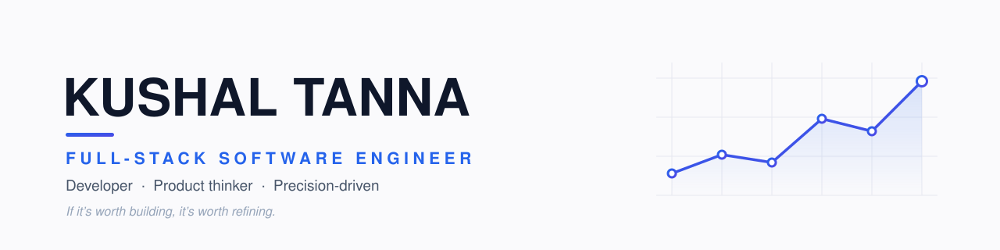

  

  
  
  
  

 

### Currently
Building digital-twin & large-scale data platforms on **Google Cloud** at **Adani Green Energy** — turning millions of operational data points into tools people actually use.

### Stack
**Languages** &nbsp;TypeScript · Python · JavaScript · SQL
**Frontend** &nbsp;&nbsp;React · Next.js · Redux
**Backend** &nbsp;&nbsp;&nbsp;Django · Node.js · GraphQL · REST
**Cloud** &nbsp;&nbsp;&nbsp;&nbsp;&nbsp;&nbsp;GCP · Docker · PostgreSQL · MongoDB

### Off the editor
Films · Music · The gym · Far too many tech deep-dives

 

M.Sc. Information Technology · DA-IICT
